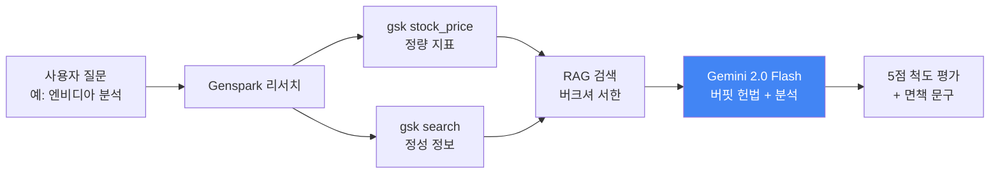

# 📈 주식왕 스토킹 (StockKing)

**워렌 버핏 스타일 AI 주식 분석기** — RAG 기반 투자 철학 분석 시스템

[](https://www.python.org/downloads/)
[](https://streamlit.io)
[](https://aistudio.google.com)
[](LICENSE)

---

> 💡 **GenSpark Meetup 해커톤 출품작**  
> 본 프로젝트는 기존 토이 프로젝트였던 [stockking](https://github.com/bu11ymaguire/stockking)을 기반으로, GenSpark Meetup 해커톤에 참가하여 기능을 고도화하고 한 단계 더 발전시킨 프로젝트입니다.  
> **Made By GenSpark**

## 🎯 프로젝트 개요

주식왕 스토킹은 워렌 버핏의 투자 철학을 AI로 재현한 주식 분석 시스템입니다.

- **Genspark CLI(`gsk`)** 로 실시간 재무 지표 + 시장 정보 수집
- **로컬 임베딩 + FAISS RAG** 로 버크셔 해서웨이 주주 서한 분석
- **Google Gemini 2.5 Flash** 로 버핏 가치관을 적용한 종합 분석 생성

---

## ✨ 주요 기능

### 1. 🔍 정량 + 정성 데이터 수집 (Genspark CLI)
- `gsk stock_price` → **ROE, ROIC, FCF, DCF, P/E, P/B** 등 핵심 재무 지표 자동 수집
- `gsk search` → 최신 뉴스, 분석 기사, 시장의 관심사
- **별도 API 키 발급 불필요** (Genspark 계정만 있으면 됨)
- **한국어 종목명 자동 매핑** (엔비디아 → NVDA, 삼성전자 → 005930.KS 등)

### 2. 📚 버핏 철학 기반 분석
- 버크셔 해서웨이 주주 서한 PDF에서 핵심 원칙을 코드 상수로 내재화 (`buffett_philosophy.py`)
- FAISS 벡터 검색으로 회사별 맞춤 인사이트 동적 추출
- Gemini가 버핏 가치관을 **system prompt** 단계에서 내재화

### 3. 🤖 5가지 투자 기준 평가
1. **비즈니스 이해도** (Circle of Competence) — 1-5점 명시 기준
2. **경제적 해자** (Economic Moat) — 가격결정력, 진입장벽
3. **경영진 평가** — 자본배분, ABC 증상 확인
4. **밸류에이션** (Margin of Safety) — 내재가치 대비
5. **종합 의견** — 강점/우려/버핏 인용 포함

### 4. 🛡️ 안전 가드레일
- 매수/매도/보유 같은 명시적 액션 권고 **금지**
- 구체적 가격 단정 **금지**
- 면책 문구 의무 포함
- 정보 부족 시 점수 대신 "N/A" 표기

### 5. 🎨 Streamlit UI
- **streamlit-option-menu**: 직관적 네비게이션
- **streamlit-extras**: 메트릭 카드, 컬러 헤더
- 결과 다운로드 (TXT)

---

## 🏗️ 아키텍처



**LangGraph 워크플로우**: `research → rag_wisdom → analysis → END`

---

## 🚀 빠른 시작

### 1. 환경 설정

```powershell
# 리포지토리 클론
git clone https://github.com/bu11ymaguire/stockking_mk2.git
cd stockking

# 가상환경 생성 (Windows PowerShell)
python -m venv .venv
.\.venv\Scripts\Activate.ps1

# PowerShell 실행 정책 에러 시:
# Set-ExecutionPolicy -Scope Process -ExecutionPolicy Bypass

# 패키지 설치
pip install -r requirements.txt
```

### 2. Genspark CLI 설치

[Genspark](https://www.genspark.ai) 계정이 필요합니다. `gsk` CLI 설치 후:

```powershell
gsk login
gsk login-info  # 로그인 확인
```

### 3. Gemini API 키 발급 (무료!)

1. [Google AI Studio](https://aistudio.google.com/apikey) 접속
2. 구글 로그인 → **"Create API key"** 클릭
3. `AIza...` 로 시작하는 키 복사
4. 신용카드 등록 **불필요**

**무료 티어 한도 (2026년 4월 기준):**
- 분석 (Gemini 2.5 Flash): **분당 10회, 일일 1,500회, 분당 25만 토큰**
- 임베딩은 **로컬 모델** 사용 (한도 없음)

### 4. PDF 준비

버크셔 해서웨이 주주 서한 PDF를 프로젝트 루트에 `stockking.pdf` 이름으로 배치.

### 5. 실행

```powershell
streamlit run streamlit_app.py
```

브라우저가 열리면:
1. Gemini API 키 입력 → 로그인
2. 분석할 종목 입력 (예: "엔비디아 분석해줘", "Microsoft 투자 가치")
3. 🚀 분석 시작 클릭

---

## 📁 프로젝트 구조

```
stockking/
├── streamlit_app.py          # 🎨 Streamlit UI (메인 진입점)
├── agent.py                  # 🤖 InvestmentAgent + LangGraph 워크플로우
├── buffett_philosophy.py     # 📜 버핏 헌법 (시스템 프롬프트 상수)
├── genspark_research.py      # 🔍 Genspark CLI 리서치 모듈
├── main.py                   # 💻 CLI 진입점 (디버깅용)
├── test_agent.py             # 🧪 에이전트 단위 테스트
├── stockking.pdf             # 📄 버크셔 서한 (사용자 준비)
├── requirements.txt          # 📦 의존성
├── .env.example              # 🔐 환경변수 템플릿
└── README.md
```

---

## 🧠 핵심 모듈 설명

### `buffett_philosophy.py` — 버핏 헌법
버크셔 해서웨이 주주 서한에서 추출한 가치관을 **코드 상수**로 내재화:
- 10대 투자 원칙
- 자본 배분 철학
- 경영진 평가 기준
- 밸류에이션 접근법
- Red Flags
- 상징적 인용구 6개
- 사례 기업 (See's Candy, Dexter Shoe 등)

`build_buffett_constitution()` 함수가 이를 통합해 LLM system prompt를 생성합니다.

### `genspark_research.py` — 리서치 엔진
- `extract_ticker()`: 사용자 질문에서 티커 자동 추출 (한국어 매핑 포함)
- `fetch_stock_data()`: `gsk stock_price`로 정량 지표 수집
- `fetch_web_research()`: `gsk search`로 정성 정보 수집
- `research()`: 통합 텍스트로 변환해 LLM에 전달

### `agent.py` — LangGraph 워크플로우
3개 노드로 구성:
1. **`genspark_research_node`** — 회사 데이터 수집
2. **`rag_buffett_wisdom_node`** — 버크셔 서한에서 관련 구절 동적 검색
3. **`gemini_analysis_node`** — 버핏 헌법 + 데이터 → 종합 분석

---

## 💻 사용 예시

### Streamlit 웹 앱

브라우저에서:
- **"엔비디아 분석해줘"**
- **"Microsoft 투자 가치는?"**
- **"TSLA 사야 할까?"**
- **"삼성전자 어때?"**

### Python 코드에서 직접 사용

```python
from agent import InvestmentAgent

agent = InvestmentAgent(
    google_api_key="AIza...",
    pdf_path="stockking.pdf"
)

result = agent.analyze_stock(
    user_query="What is NVIDIA?",
    openai_max_tokens=2000,    # Gemini max output tokens (이름은 하위 호환)
    openai_temperature=0.3
)

print(result["final_analysis"])
print(result["market_data"]["raw_response"])  # 수집된 시장 데이터
print(result["buffett_insights"])             # RAG 인사이트
```

### CLI (디버깅용)

```powershell
python main.py
```

PDF 처리 과정 점검 + 인터랙티브 분석.

---

## 🔧 커스터마이징

### 분석 파라미터

**Gemini 설정** (Streamlit 사이드바):
- `max_tokens`: 500~4000 (기본 2000) — 분석 답변 길이
- `temperature`: 0.0~1.0 (기본 0.3) — 낮을수록 보수적/일관적

### 한국어 종목 매핑 추가

`genspark_research.py`의 `_KR_NAME_TO_TICKER` 딕셔너리에 추가:

```python
_KR_NAME_TO_TICKER = {
    "엔비디아": "NVDA",
    "내가추가": "TICKER",  # 여기에 추가
    ...
}
```

### PDF 교체

다른 투자 서적을 사용하려면 `stockking.pdf`를 원하는 PDF로 교체. RAG가 자동으로 새 문서로 재구축됩니다.

### 임베딩 모델 변경

`agent.py`의 `initialize_rag()`에서:

```python
embeddings = HuggingFaceEmbeddings(
    model_name="sentence-transformers/paraphrase-multilingual-MiniLM-L12-v2",
    # 더 큰 모델: "sentence-transformers/paraphrase-multilingual-mpnet-base-v2"
)
```

---

## 📌 주의사항

### ⚠️ 투자 책임
- 본 도구는 **교육·연구 목적**입니다
- AI 분석 결과를 맹신하지 마세요
- 실제 투자 결정은 본인의 책임입니다
- 액션 권고 (매수/매도)는 의도적으로 출력하지 않습니다

### ⚠️ API 한도
- **Gemini 2.0 Flash**: 분당 15회, 일일 1,500회 (무료)
- **Genspark**: 계정별 크레딧 한도
- 한도 초과 시 1분 대기 후 재시도

### ⚠️ 첫 실행 시 다운로드
- HuggingFace 임베딩 모델 (~120MB) 자동 다운로드
- 캐시 위치: `~/.cache/huggingface/`
- 두 번째 실행부턴 즉시 로드

---

## 🛠️ 트러블슈팅

### `ModuleNotFoundError: No module named 'langchain_google_genai'`
```powershell
pip install -r requirements.txt
```
가상환경이 활성화됐는지 확인 (`.venv` 표시).

### `404 NOT_FOUND: models/text-embedding-004 is not found`
Google이 모델을 deprecate한 경우. 로컬 임베딩으로 전환했으므로 최신 코드에선 발생 안 함.

### `RESOURCE_EXHAUSTED: 429`
Gemini API 분당 한도 초과. **1분 대기 후 재시도** 또는 분석 횟수 줄이기.

### `gsk: command not found`
[Genspark CLI](https://www.genspark.ai) 설치 후 `gsk login` 실행.

### PowerShell 실행 정책 에러
```powershell
Set-ExecutionPolicy -Scope Process -ExecutionPolicy Bypass
```

---

## 🤝 기여하기

```powershell
git clone https://github.com/your-username/stockking_mk2.git
git checkout -b feature/amazing-feature
# 작업 후
git commit -m "Add: 놀라운 기능 추가"
git push origin feature/amazing-feature
# Pull Request 생성
```

---

## 📝 라이선스

MIT License — 자유롭게 사용, 수정, 배포 가능

---

## 📧 문의

- **GitHub**: [@bu11ymaguire](https://github.com/bu11ymaguire)
- **Issue**: [문제 리포트](https://github.com/bu11ymaguire/stockking_mk2/issues)

---

## 🙏 감사의 글

**Special Thanks:**
- **[SKT8LL 팀](https://github.com/SKT8LL)** — 원본 Jupyter Notebook을 Python 웹 애플리케이션으로 발전시킨 버전입니다.

**Powered by:**
- **Warren Buffett & Berkshire Hathaway** — 투자 철학 제공
- **Google Gemini** — 2.0 Flash 분석 모델
- **Genspark** — 실시간 재무 데이터 + 웹 검색
- **HuggingFace Sentence Transformers** — 다국어 로컬 임베딩
- **LangChain + LangGraph** — RAG 프레임워크 + 워크플로우
- **Streamlit** — UI 도구
